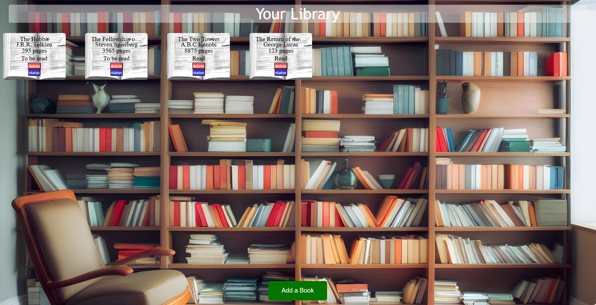

# Project: Personal Library

Welcome to my Personal Library project! This is a simple web application designed to help you keep track of books you’ve read and those you haven’t.

Current look:

## Features

- **Book Cards**: Display a list of books with details including name, author, number of pages, and read status.
- **Add New Books**: A button allows you to add new books to the library.

## Technologies Used

- **HTML**: Structure of the webpage.
- **CSS**: Styling and layout of the webpage.
- **JavaScript**: Functionality, including the use of constructors and prototypes to manage book data and interactions.

## How It Works

1. **HTML Structure**: The page is divided into a central container that holds the book cards. Each card displays information about a book.
2. **CSS Styling**: The CSS ensures that the book cards are visually appealing and the layout is clean and responsive.
3. **JavaScript Functionality**: 
    - **Book Constructor**: Defines the structure of a book object.
    - **Prototype Methods**: Adds methods for managing books, such as updating read status and displaying book information.
    - **Event Handling**: Manages user interactions, such as adding new books and updating existing ones.

## Future Enhancements
1. **Persist Data**: Implement local storage to save book data between sessions.
2. **Advanced Features**: Add search and filter options to find specific books easily.
3. **User Authentication**: Allow multiple users to maintain their own libraries.
4. **Responsive UI Design**: Make the page adapt to different window sizes